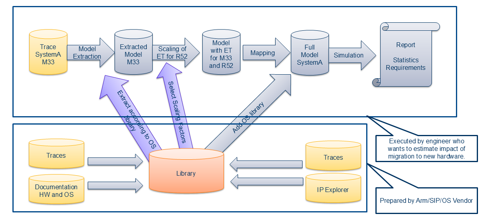

# Callisto

The project Callisto targets the prediction of real-time behaviour in very early 
phases of the system design. It was designed to specifically support the migration of 
single core systems to complex systems of chips. Changes in the underlying processor architectures are also supported.

## Use Cases and Challenges

### Migration Without Hypervisor
* 1 Old Core ==> 1 New Core

### Migration With Hypervisor
* n Old Cores ==> m New Cores
* Hypervisor with TDMA

### Impact of New Target Hardware on Software Architecture
* Depending on integration scenario software architecure has to be adapeted for target system
  * Mapping of software componentes to clusters and cores
  * Consideration of reconfiguration or exchange of BSW stack ==> Changed structure of tasks and mainfunctions
   

### Scaling of Execution Times and Other Effects
* One scaling factor is not sufficient
* Goal: Fine granular scaling of execution times (Tasks, Runnables)
* Additional consideration of interference (channels), if software is executed in parallel on multiple cores

## Workflow

1. The existing application is [traced on the old platform](doc/PMUTracing.md).
2. From this trace, a [scheduling and timing model is extracted](doc/ModelExtraction.md).
3. The timing model is [scaled](doc/Scaling.md) for the new platform. The scaling can be different for different parts of the application.
4. The application is mapped to the components of the new platform.
5. A scheduling simulations generates a report, which summarizes the predicted 
   behaviour of the application on the new platform.

The basic idea is shown in the picture.

* Somewhere we have to explain the library based approach.
* Library is prepared by Arm, SIP, OSVendor
* Library is used when Architect at OEM, T1, ... plans migration to new SoC

### Mapping to Target Hardware

##### General Approach
* Models that were extracted from traces can be simulated with the same hardware on which the trace was recorded. This allows detailed analysis or the source system in high load situations, corner cases, ....
* To analyse the behaviour on target hardware the software from source system has to be mapped on target hardware.

##### Consideration of OS Overheads
* The OS overheads (context switch, ISR entry/exit, ...) are very different on target hardware. The overheads were on source hardware were identified during trace processing and can be removed easily. The overheads on target hardware are part of library and can be applied according to new mapping.

##### Hypervisors

### Model Based Timing Simulation and Report Generation
